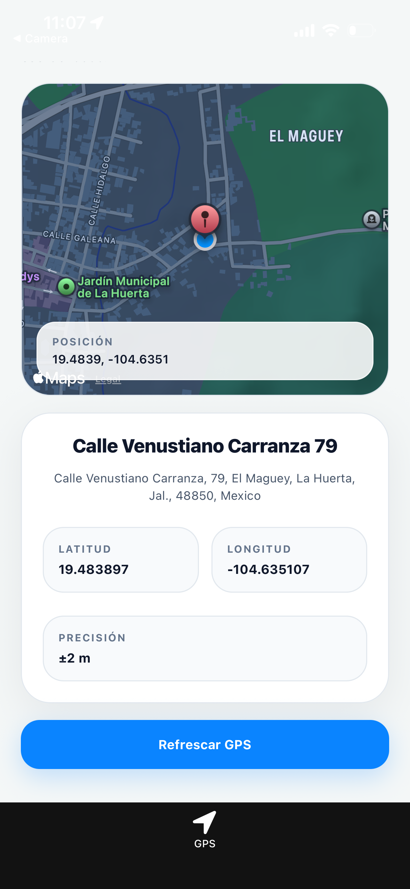

# GPS Location Demo

Una demo elegante y directa para mostrar la ubicacion exacta del usuario en tiempo real, con mapa, marcador, direccion aproximada y coordenadas precisas.

## Vista General

Este proyecto esta construido con Expo y React Native para demostrar una implementacion clara de GPS en dispositivos moviles. La interfaz esta pensada para sentirse limpia, sobria y moderna, con una sola experiencia principal centrada en la ubicacion del usuario.

La pantalla principal realiza este flujo:

- solicita permisos de ubicacion en primer plano
- obtiene la posicion actual del dispositivo
- centra el mapa sobre la ubicacion detectada
- coloca un marcador en el punto activo
- intenta resolver el nombre y la direccion aproximada del lugar
- actualiza la lectura en tiempo real cuando el usuario se mueve

## Captura de Pantalla



## Tecnologia Utilizada

- Expo Router para la navegacion basada en archivos
- `expo-location` para permisos, GPS y geocodificacion inversa
- `react-native-maps` para renderizar el mapa y el marcador
- `expo-device` para detectar si se ejecuta en simulador o en dispositivo real
- React Native para la interfaz
- TypeScript para tipado y mantenimiento

## Como Funciona

1. Al abrir la app, la pantalla principal activa la vista GPS.
2. El sistema verifica que los servicios de ubicacion esten habilitados.
3. La app solicita permiso de ubicacion al usuario.
4. Si el permiso es concedido, obtiene la coordenada actual del dispositivo.
5. El mapa se centra automaticamente en la posicion detectada.
6. Se agrega un marcador sobre el punto actual.
7. La app realiza geocodificacion inversa para mostrar el nombre del lugar y la direccion aproximada.
8. Con seguimiento continuo, la pantalla vuelve a leer la posicion cuando el usuario se mueve.

## Funcionamiento en Simulador y en iPhone Real

La precision depende del entorno de prueba:

- en iPhone real, el GPS usa la ubicacion fisica del dispositivo
- en simulador, la ubicacion puede ser simulada o estar fija en una zona por defecto
- si la precision es baja, la direccion puede variar o resolverse solo de forma parcial

Si pruebas en iOS Simulator, puedes configurar una ubicacion manual desde las opciones de simulador. Para pruebas reales, se recomienda un iPhone fisico con Ubicacion precisa activada.

## Instalacion

1. Instala las dependencias:

```bash
npm install
```

2. Inicia la app en iOS:

```bash
npm run ios
```

Tambien puedes iniciar el proyecto general con:

```bash
npm run start
```

## Uso

- Abre la app en un iPhone real o en el simulador.
- Acepta el permiso de ubicacion cuando el sistema lo solicite.
- Observa el mapa, el marcador y la tarjeta con la direccion.
- Presiona `Refrescar GPS` si quieres forzar una nueva lectura.

## Dependencias Clave

- `expo-location`
- `react-native-maps`
- `expo-device`
- `expo-router`

## Estructura Relevante

- `app/(tabs)/index.tsx` - pantalla principal de GPS
- `app/(tabs)/_layout.tsx` - navegacion de pestañas
- `app.json` - permisos y configuracion nativa
- `assets/images/pantalla-inicio.PNG` - captura de pantalla sugerida
- `package.json` - dependencias y scripts

## Scripts Disponibles

```bash
npm run ios
npm run android
npm run web
npm run lint
npm run start
```

## Notas de Desarrollo

- El proyecto usa Expo Router con una sola pestaña visible enfocada en GPS.
- La interfaz esta pensada para una presentacion sobria, limpia y funcional.
- La imagen de portada ayuda a documentar el estado visual de la app en el README.

## Soporte de Permisos

La app requiere permisos de ubicacion en primer plano para funcionar correctamente.

En iOS, el permiso se define en `app.json` dentro de `ios.infoPlist`.

En Android, la app solicita permisos de ubicacion coarse y fine.

## Recomendaciones

Si quieres llevar esta demo a una version mas completa, puedes agregar:

- una captura adicional con otro estado del mapa
- compartir ubicacion desde la app
- historial de ubicaciones recientes
- una capa visual mas cercana a Apple Maps

